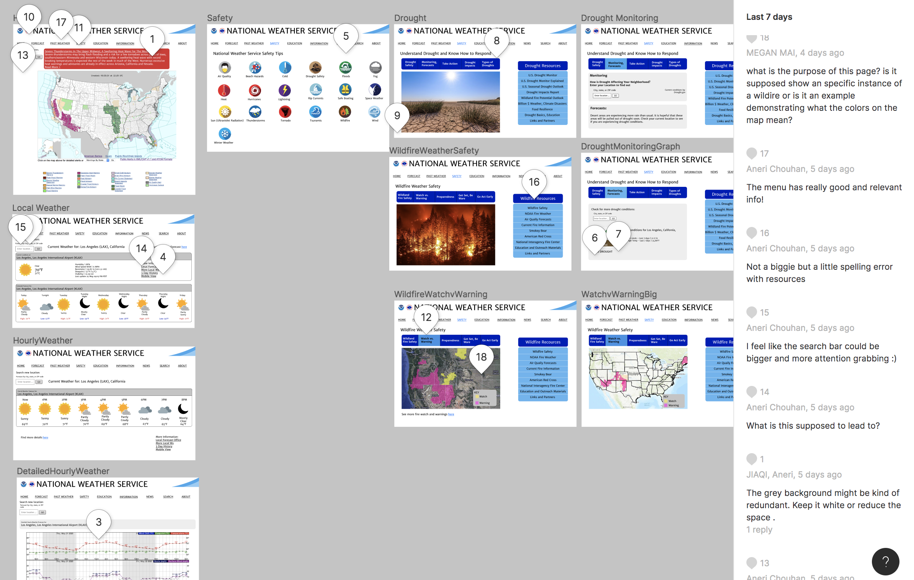

# DH150-Assignment07-HighFidelity

## Emily DiPressi 

## High-Fidelity Prototype

My high-fidelity prototype can be found [here](https://www.figma.com/proto/3KVvLhIFcdui8PiMWYauCT/DH150-Assignment7-HighFidelityPrototype?node-id=29%3A4&scaling=min-zoom)

## About the Project 

### Summary 
My project focuses on weather.gov. This site has functions for basic weather searches for users current location or to more detailed information on weather safety features or phenomenal weather patterns. Upon first using this website, I was really frustrated with how inconsistent the different pages were from each other: different designs, text colors and sizes, and being taken to other webpages. Information that should have been presented in a clearer way was not and it made it hard to read and understand. My goal with weather.gov was to streamline the design and make the information presented easier to read and to fill in the missing gaps that were on the original website. I designed with a wide variety of users in mind: users with colorblindness, users that needed information fast and not presented in a complicated manner,  and users that are not a tech savvy as younger generations. 
 
### High-Fidelity
The high-fidelity prototype is the last step in this process of usability testing, user study, design, and low-fidelity prototyping. The purpose of this high-fidelity prototype is to test visually how the website will look and function. It can test the color, size, placement, and overall organization of the webpage before being programmed as a live site. My high fidelity prototype is for weather.gov. The tasks that are functional on this prototype are searching for the hourly weather for a specific location, checking the drought conditions for a current location, and searching for fire watch/warning information, and to navigate back to the homepage.

## Design 
### Design Decisions 
Blue was the original color used on website, so I decided to stick with the current theme. I also know that blue is a colorblind friendly color, so that was another reason for choosing blue. One of the personas I created was colorblind, so I needed to make sure that it would work with everyone. Another function that I wanted to make sure that was included for the user was a way to show what page the user was on. Wherever possible I changed the text color or background color of a text box/button to give feedback to the user about where they were in the website if they got lost, or wanted an easy way to navigate back to the page they were on last. I also tried to keep things minimalist with a white background, black text, and blue and grey accents. The most important part of this website is the important information the user is searching for, they do not need to be distracted by lots of colors or excessive images. When images are used, they are used in to be a quicker identifier for the user: such as a sun icon for sunny weather or a wilting plant for drought. This website was designed for people who want important and detailed information and I tried to convey that with the new design. 

### Distinct Screens 

I have four distinctive screens: Home, Safety, Local Weather, and Drought/Wildfire. Some of these screens have slightly varying designs and information.

### Color Contrast 
I used the “Contrast” plugin on Figma (instead of Stark) to check the color contrast on an AA level. It shows somethings as failing, but when clicking on it individually it passes. I checked this for all items that were marked failed and made sure they all passed. 

 | 
---------------------- | --------------
 |  
 
## Tasks 

### Task One
Task one is to find the hourly weather for a users current location. To do this the user will first navigate to weather.gov. From the home page the user will input their zip code or city and state into the search widget and press “Go”. After being brought to the “Current Conditions” page for their location, the user will click on “Hourly Weather Forecast here”. The user will then be on the page that has the hourly weather report for their location. If the user wants more detailed information by the hour they can click on “Find more details here”. The user can search weather for another location with the search bar. They can also click on “Safety” in the top menu bar. To go home from any of the pages in this sequence the user can click on “Home” or the “National Weather Service” text bar and either image in that bar. 

### Task Two 
Task two is to find drought conditions for a users desired location. After navigating to weather.gov, from the home page, the user will click on “Safety” in the top menu line up. From “Safety”, now highlighted in blue, the user can choose from an array of safety concerns. They will choose “Drought Safety”. To find current conditions, the user will click on “Monitoring, Forecasts” and from that tab page, they will enter the location they wish to see and click “Go”. The user will be taken to a page that has information provided by drought.gov about the current drought conditions in their area. They can search another location from this page if they wish to see conditions in other areas. To go back the user can navigate back to “Safety” and search more safety features or click on “Home” or “National Weather Service” and the icons in the top bar as well. This works from every page along the journey.

### Task Three
Task three is to find wildfire watch and warning. To find this information, the user will navigate to weather.gov and from the home page, they will click on “Safety”. Once in the “Safety” page, the user will find “Wildfire” towards the bottom of the page, as the safety options are alphabetized. To find the watch and warning areas, the user will click on the “Watch vs. Warning” tab above the picture. The user will be presented with a partial map of the United States with a key that identifies the areas that are under watch and under warning. If the users area of concern is not in the map pre-set, the user will scroll down to under the map and will find “See more fire watch and warnings here” this will take the user to a full map of the United States with areas highlighted in pink and yellow with another key that explains each colors meaning. Once here, the user may click on “Safety” again to look at other safety topics or they can click on the “National Weather Service” text or icons or click “Home” and the user can navigate to another page from there.

### Interactive Wireflow 

 
## Testing 

### Impression Test
#### Quotes 
> “I think I can learn about potential incoming natural disasters, how to stay safe under certain weather conditions, and other relevant weather information.”

> “Sometimes I was unaware what was clickable and what was not.”

> “I like that the button turns blue when you visit the page.”

#### Findings
text here

### Cognitive Walk Through 
#### Quotes 
> “I feel like the search bar could be bigger and more attention grabbing”

> “The menu has really good and relevant info!” 

> "The grey background might be kind of redundant. Keep it white or reduce the space."

#### Evidence

#### Findings
From the cognitive walkthrough, I got feedback about making some elements of the webpage larger, such as the search location and some of the text on the pages. In order to make things more apparent I changed the color, such as the warning on the homepage from grey to red, and I moved the search function to be in a higher spot on the drought conditions page. I also got mixed feedback on knowing what was clickable and what wasn’t i.e. are underlined words clickable or not. 
